# Web Solution with WordPress

*Demonstration of how to prepare a storage infrastructure on three Linux servers and implement a basic web solution using WordPress. The source code used on this project was retrieved from darey.io.* 

*Instructions on how to launch and connect to your EC2 instance using an SSH client:*
 
https://github.com/Antonio447-cloud/MEAN-stack-angular

    Happy learning!
-----------
## Outline
    
In this project we will prepare a storage infrastructure on two Linux servers and implement a basic web solution using WordPress. The WordPress management system will be written in PHP and paired with MySQL or MariaDB as its backend Relational Database Management System (RDBMS)

This project consists of two parts:

- Configuring storage subsystem for web and database servers based on Red Hat Enterprise Linux (RHEL) 8 HVM.

- Installing WordPress and connecting it to a remote MySQL database server.
----------

## Preparing your Web Server and Creating its Volumes

So first we will create 2 volumes for our 2 web server's instances. Both in the same Availablity Zone (AZ) as our web server EC2 instance. You can configure the AZ when you are launching your instance by clicking on "Subnet" and selecting your preferred AZ:

We will put 10 GB on each volume. To do that we click on "Volumes" we can find it under "Elastic Block Store":

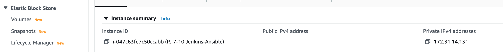

Then we create 3 volumes of 10 GB each. So, first we click on "Create volume" located on the top right corner:

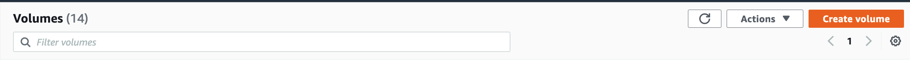

Then we make sure the volume is in the same AZ as our instance and we input "10" on "Size (GiB)":

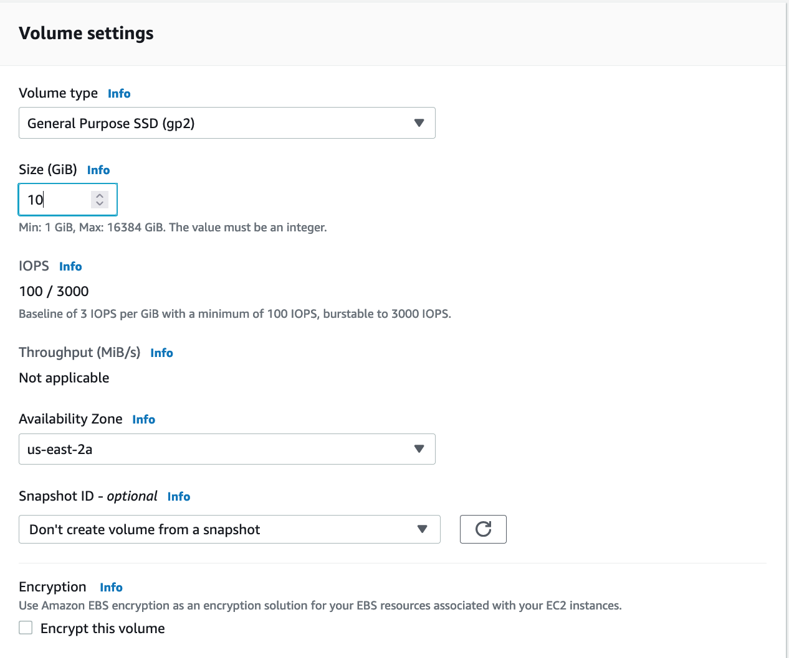

## Attaching the Volumes to your Web Servers

After creating each of the volumes for our 3 web servers, we need to attach each of the 3 web servers to each of the 3 volumes we have just created. Keep in mind that the 3 volumes and your web servers will need to be on the same Availability Zone (AZ). We can configure this by clicking on "Subnet" and selecting the AZ that we want when launching our instance:

Now, we need to attach each of the 3 volumes to each of of our 3 web servers. To do so we select the volume that we want to attach to our web server then we click on "Actions" and then "Attach":

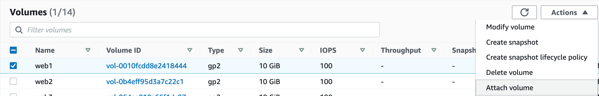

After confirming that the instance we want to attach is on the same AZ as the volume, we click on the drop down menu that is listed under "Instance" then we type the name of our instance, then we click on "Attach volume":

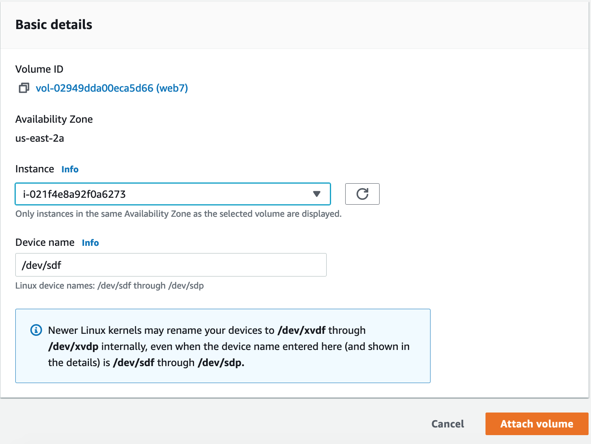

We repeat this process with each of our 3 web servers:

Now, we run `lsblk` to confirm that our block devices are attached to our web server:

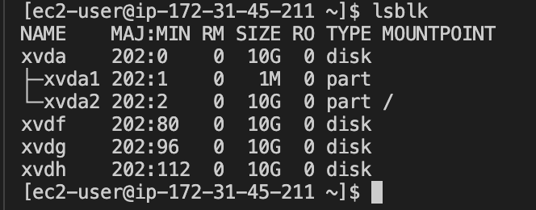

As we can see the block devices are attached to our web server. The names of our block devices are "xvdf", "xvdg" and "xvdh."

After that, we need to run `df -h` to see all mounts available and free space on our server:

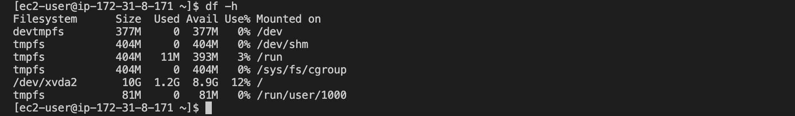

## Creating Partitions for our Block Devices

We will use `sudo gdisk` to create a partition on each of the 3 disks

So: `sudo gdisk /dev/xvdf` 

Followed by:  `sudo gdisk /dev/xvdg` 

And: `sudo gdisk /dev/xvdh`

- We input"n" on "command" in order to create a new partition.

- Then we input "1" or press "enter" for "Partition number".

- We press enter for "First sector" since we want to use the entire disk.

- We press enter for "Last sector" as well.

- Since we want to use this partition for logical volume management we input "8e00" on "Hex code or GUID" to change the type to logical volume management.

- We input "p" on "command" to check what we have so far.

- Lastly we press "w" to write. We can see that our operation was successful.

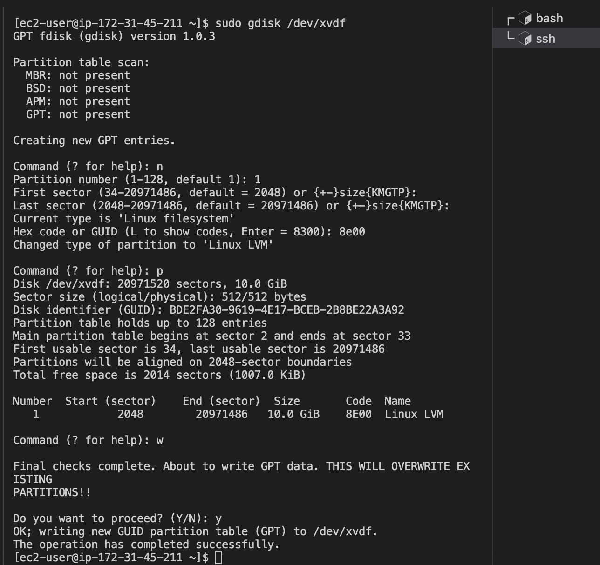

We repeat the same process for the 2 remaining disks and we run `lsblk` after completing the process, it should look like this:

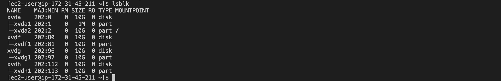

## Installing Linux Logical Volume Management 

Now, we will install the lvm2 package using:

`sudo yum install lvm2 -y` 

Then we check for available partitions:

`sudo lvmdiskscan` 

We confirm that the lvm2 package has been installed:

`which lvm`

## Creating Physical Volumes, Logical Volumes and Volume Groups

After confirming that the lvm2 package was installed, we create a utility to mark each of the 3 disks as physical volumes (PVs) to be used by the LVM:

`sudo pvcreate /dev/xvdf1 /dev/xvdg1 /dev/xvdh1`

To verify that our PVs have been created:

`sudo pvs`

To add all 3 PVs to a volume group (VG) we use `vgcreate`. We will name the VG "webdata-vg":

`sudo vgcreate webdata-vg /dev/xvdf1 /dev/xvdg1 /dev/xvdh1`

We verify that our VGs have been succesfully created:

`sudo vgs`

Then we run:

`sudo lvcreate -n apps-lv -L 14G webdata-vg`

`sudo lvcreate -n logs-lv -L 14G webdata-vg`

**NOTE**: *The command above is used to create 2 logical volumes, "apps-lv" on which we use half of the PV size, and "logs-lv" on which we use the remaining space of the PV size.*

*"apps-lv" will be used to store data for the website*

*"logs-lv" will be used to store data for logs*

Now we run:

`sudo lvs`

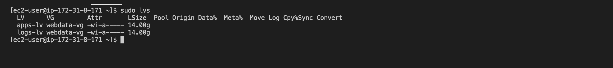

We verify the entire setup:

`sudo vgdisplay -v`

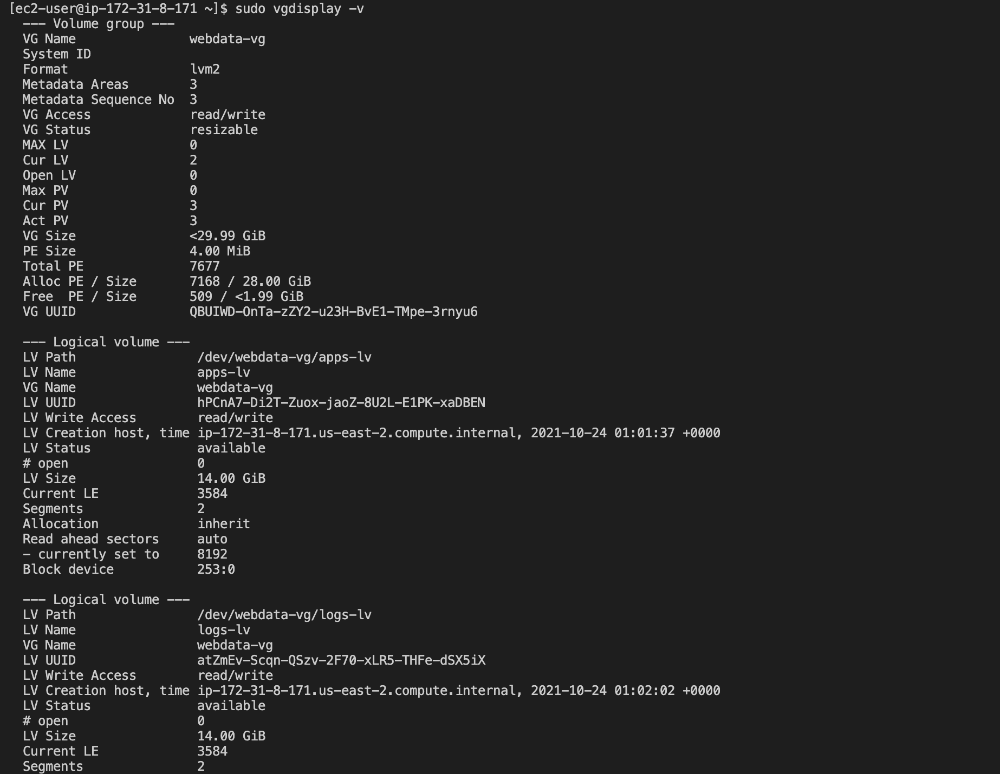

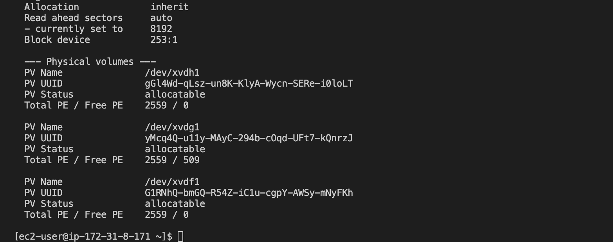

We can see our complete setup above. We can see our VGs, LVs, and PVs.

We can also run:

`sudo lsblk`

## Formatting your Logical Volumes

We will use `mkfs` to format the logical volumes with the `ext4` filesystem:

`sudo mkfs -t ext4 /dev/webdata-vg/apps-lv`

`sudo mkfs -t ext4 /dev/webdata-vg/logs-lv`

We create a /var/www/html directory to store website files:

`sudo mkdir -p /var/www/html`

We create a /home/recovery/logs directory to store a backup of log data:

`sudo mkdir -p /home/recovery/logs`

We list the contents on our /var directory:

`sudo ls -l /var`

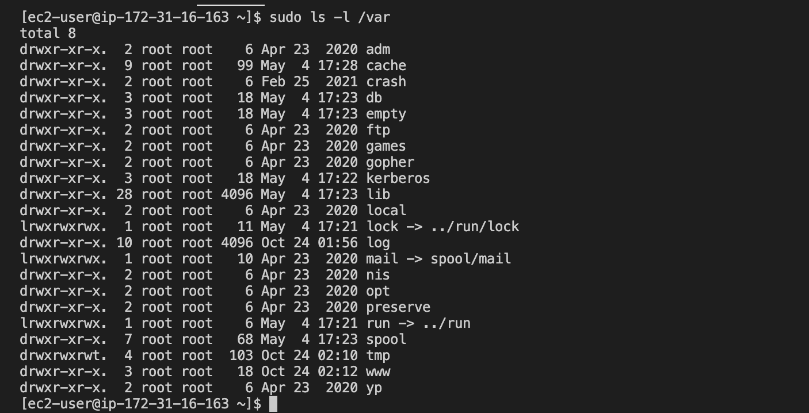

## Mounting your Logical Volumes

After making sure that the contents we need are inside our /var directory, we mount our /var/www/html directory on apps-lv:

`sudo mount /dev/webdata-vg/apps-lv /var/www/html/`

We use `rsync` utility to backup all the files in the log directory /var/log into /home/recovery/logs:

`sudo rsync -av /var/log/. /home/recovery/logs/`

**NOTE**: *Keep in mind that we need to do back up all the files using the rsync utiility before mounting the file system.*

After making sure that we backed up all of the files using the rsync utility, we mount our /var/log directory on our logs-lv:

`sudo mount /dev/webdata-vg/logs-lv /var/log`

**Note**: *all the existing data on the /var/log directory will be deleted. That is why backing all the files using the rsync utility before mounting our file system is very important.*

Now, we restore the log files back into our /var/log directory:

`sudo rsync -av /home/recovery/logs/. /var/log`

Now, we will update our /etc/fstab file so that the mount configuration will persist after restarting of the server.

The UUID (Universally Unique Identifier) of the device will be used to update the /etc/fstab file:

We update /etc/fstab using our "apps--lv" and "logs--lv" UUID that shows up when we run: `sudo blkid` 

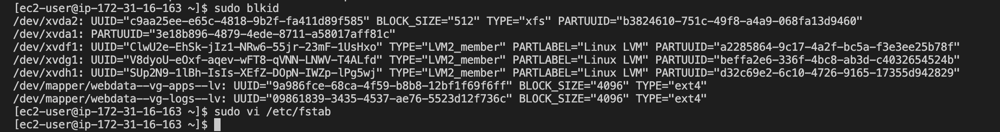

Then we copy both the apps--lv and logs--lv UUID and we run:

`sudo vi /etc/fstab`

We paste both UUIDs on our /etc/fstab using the following format:

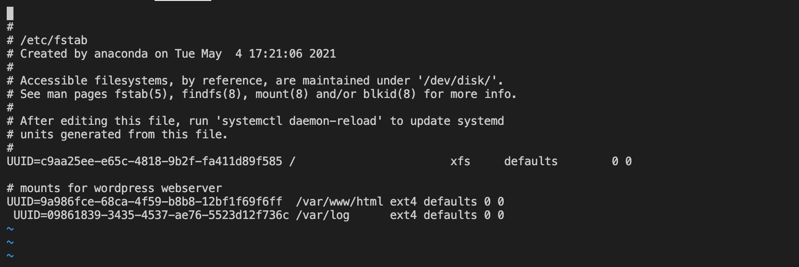

**NOTE**: *Remember to remove the leading and ending quotes of each of the "apps-lv" and "logs-lv" UUIDs when adding them to the /etc/fstab file.*

We test the configuration and reload daemon:

`sudo mount -a`

`sudo systemctl daemon-reload`

Then we verify our setup by running `df -h`, the output must look like this:

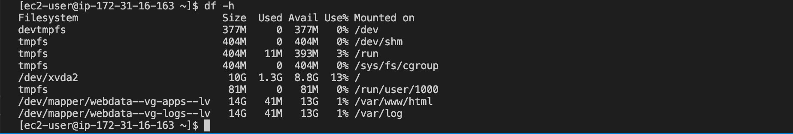

## Preparing the Database Server

We will launch a RedHat EC2 instance that will have the of role of a database server we can name it "db-server". We will create a volume and attach it to our database server the same way we did with our web servers. You can use the same instructions that are above but with your "db-server".

So, once we have launched and created 3 volumes for our 3 database servers we run `lsblk` to confirm we have attached the volumes succesfully:

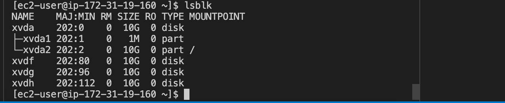

We will use `sudo gdisk` to create a partition on each of the 3 disks:

So: `sudo gdisk /dev/xvdf` 

Followed by: `sudo gdisk /dev/xvdg` 

And: `sudo gdisk /dev/xvdh`

We install the lvm2 package:

`sudo yum install lvm2 -y`

We mark each of the 3 disks as physical volumes (PVs) to be used by the LVM:

`sudo pvcreate /dev/xvdf1 /dev/xvdg1 /dev/xvdh1`

We create a 'database-vg’:

`sudo vgcreate database-vg /dev/xvdf1 /dev/xvdg1 /dev/xvdh1`

We create a ‘database-lv’ and put 20GB on it:

`sudo lvcreate -n database-lv -L 20GB database-vg`

Then we run:

`sudo lvs`

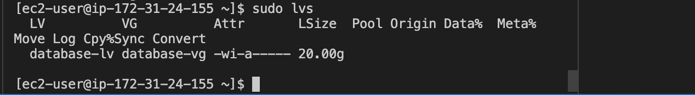

`sudo lsblk`

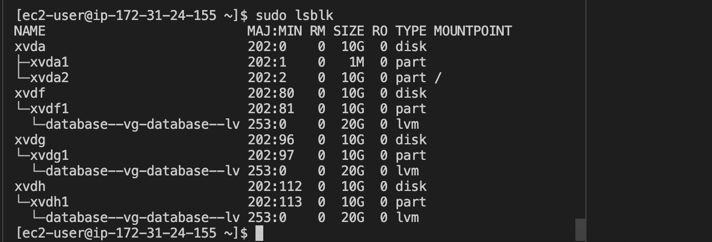

We create a db directory:

`sudo mkdir /db`

And we format the `mkfs.ext4` into logical volumes with the ext4 filesystem:

`sudo mkfs.ext4 /dev/database-vg/database-lv`

Then we mount it to our db directory:

`sudo mount /dev/database-vg/database-lv /db`

We verify that it is mounted:

`df -h`

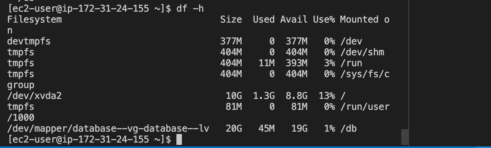

We check our 'database--vg' and 'database-lv' UUID:

`sudo blkid`

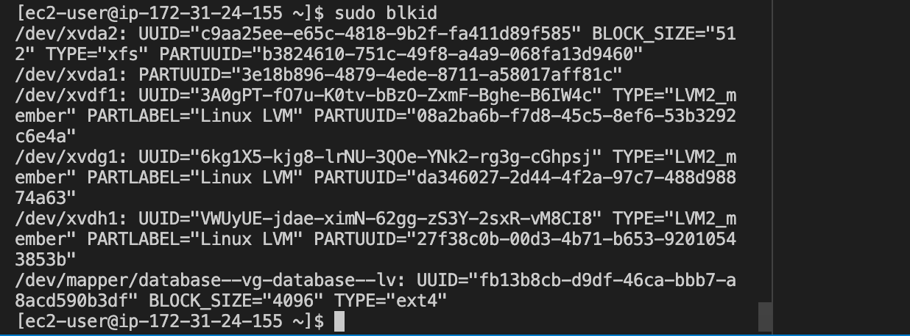

We update our /etc/fstab using our "database--vg" and "database-lv" UUID:

`sudo vi /etc/fstab`

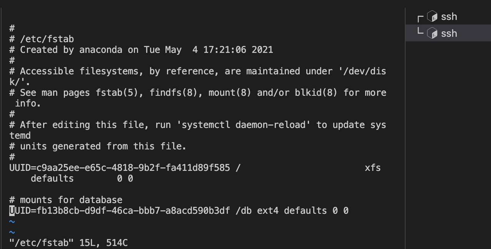

We test the configuration and reload daemon:

`sudo mount -a`

`sudo systemctl daemon-reload`

We verify our setup one more time to make sure everything looks good:

`df -h` 

## Installing WordPress on our Web Server EC2

We update our repository:

`sudo yum -y update`

We install wget, Apache and it’s dependencies:

`sudo yum -y install wget httpd php php-mysqlnd php-fpm php-json`

We start Apache:

`sudo systemctl enable httpd`

`sudo systemctl start httpd`

We install PHP and it’s dependencies:

- `sudo yum install https://dl.fedoraproject.org/pub/epel/epel-release-latest-8.noarch.rpm`

- `sudo yum install yum-utils http://rpms.remirepo.net/enterprise/remi-release-8.rpm`

- `sudo yum module list php`

- `sudo yum module reset php`

- `sudo yum module enable php:remi-7.4`

- `sudo yum install php php-opcache php-gd php-curl php-mysqlnd`

- `sudo systemctl start php-fpm`

- `sudo systemctl enable php-fpm`

- `sudo setsebool -P httpd_execmem 1`

We restart Apache:

`sudo systemctl restart httpd`

We download WordPress and copy it to our var/www/html:

  - `mkdir wordpress`

  - `cd wordpress`

  - `sudo wget http://wordpress.org/latest.tar.gz`

  - `sudo tar xzvf latest.tar.gz`

  - `sudo rm -rf latest.tar.gz`

  - `sudo cp wordpress/wp-config-sample.php wordpress/wp-config.php`

  - `sudo cp -R wordpress /var/www/html/`

  We configure SELinux Policies:

  - `sudo chown -R apache:apache /var/www/html/wordpress`

  - `sudo chcon -t httpd_sys_rw_content_t /var/www/html wordpress -R`

  - `sudo setsebool -P httpd_can_network_connect=1`

  ## Installing MySQL on your DB Server

  We run an update and install mysql-server:

`sudo yum update -y`

`sudo yum install mysql-server -y`
 
 If "mysqld" is not running, we restart the service and enable it so it will be running even after reboot:

`sudo systemctl restart mysqld`

`sudo systemctl enable mysqld`

We verify that that the MySQL server is running:

`sudo systemctl status mysqld`

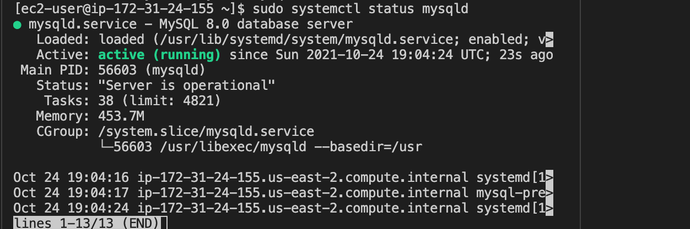

## Configuring DB to work with WordPress

We set a password for root accounts:

`sudo mysql_secure_installation`

We connect to MySQL using the password we created for root accounts:

`sudo mysql -u root -p` 

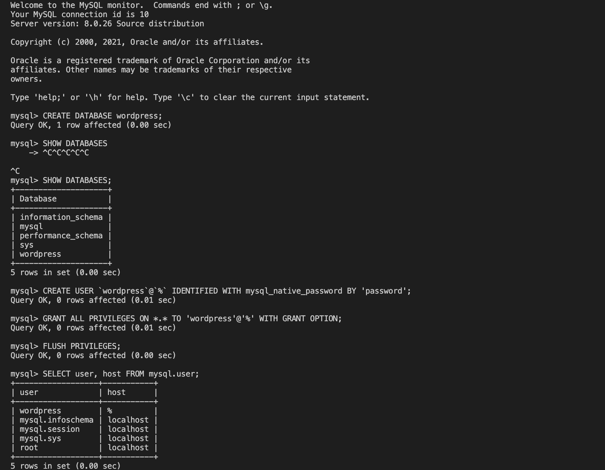

We open the "/etc/my.cnf" file:

`sudo vi /etc/my.cnf`

We add "bind address = 0.0.0.0 to [mysql]" (this only ideal for testing because it is not secure to allow access to the database from anywhere)

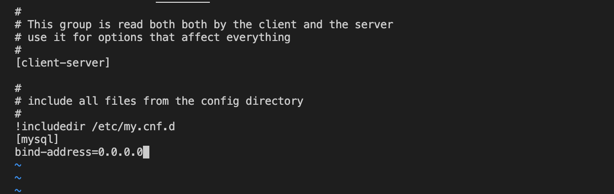

We restart mysql:

`sudo systemctl restart mysqld`

## Installing MySQL server on your Web Server

On our web server instance we run an update and install mysql-server:

`sudo yum update -y`

`sudo yum install mysql-server -y`

 We restart the service and enable it:

`sudo systemctl restart mysqld`

`sudo systemctl enable mysqld`

We verify that it is running:

`sudo systemctl status mysqld`

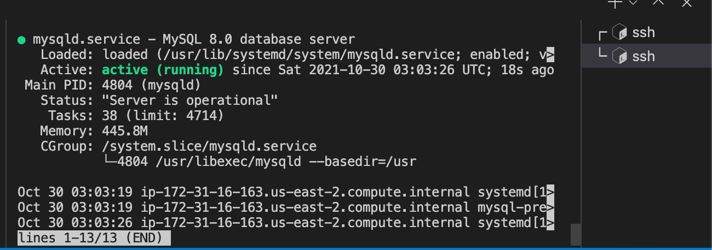

Then we change directories to our /var/www/html/ directory and open the WordPress directory inside of it:

`cd /var/www/html`

`cd wordpress`

We open the the wp-config.php" file on our WordPress directory:

`sudo vi wp-config.php`

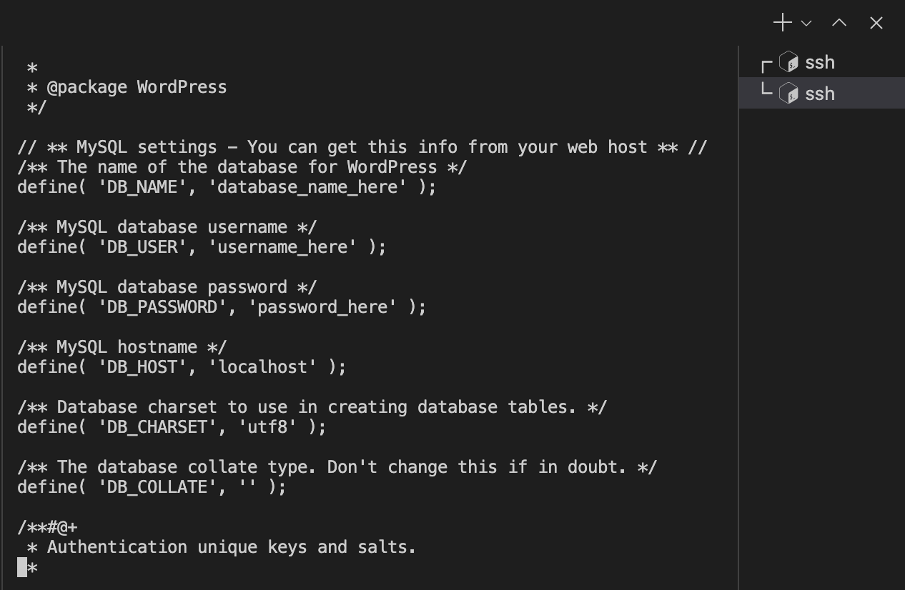

We input the values as shown on the picture below after: "DB_NAME" "DB_USER" "DB_PASSWORD" and "DB_HOST":

**NOTE**: *On "DB_PASSWORD" you need to enter your own password. I input "password" only to make it more understandable:*

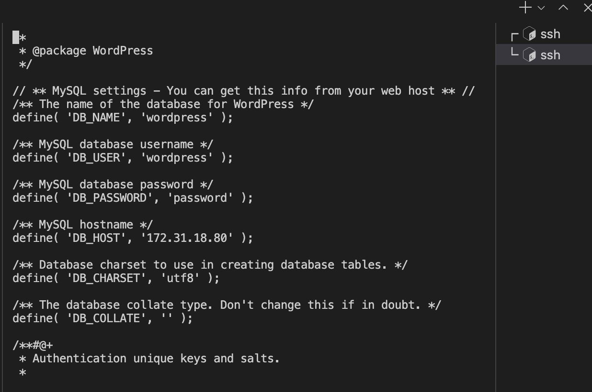

After that, we disable the Apache welcome page:

`mv /etc/httpd/conf.d/welcome.conf /etc/httpd/conf.d/welcome.conf_backup`

We restart Apache for the changes to take place:

`sudo systemctl restart httpd`

## Configuring WordPress to Connect to Remote DB

First, we open MySQL port 3306 on our DB Server EC2 Security Groups. For extra security, we will allow access to the DB server only from our web server’s private IP address. Then we need to open SSH on port 22 and HTTP on port 80:

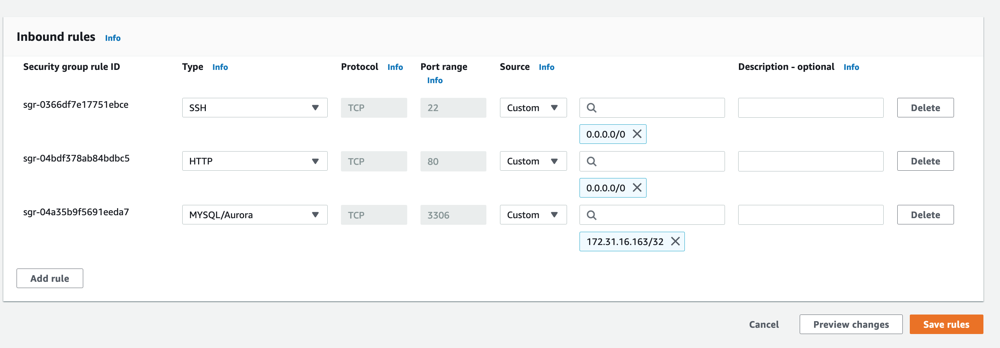

Now, we connect to our DB server from our web server:

`sudo mysql -h <DB-Private-IP-Address> -u wordpress -p`

We verify that we can successfully execute the "SHOW DATABASES;" command to see a list of our existing databases:

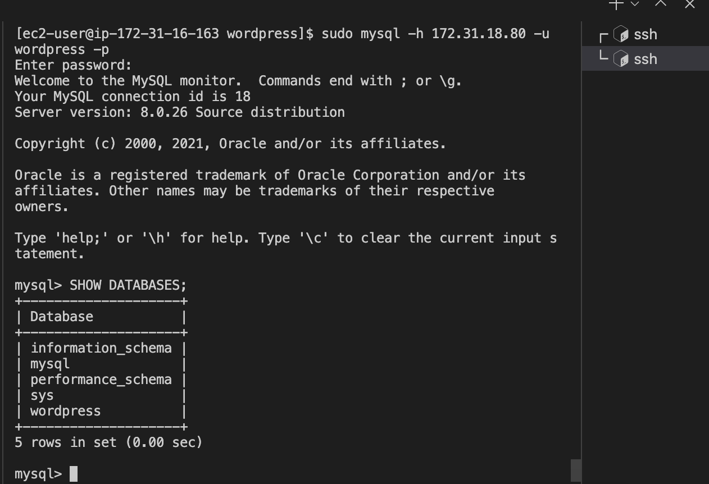

We change permissions and configuration so Apache can use WordPress:

`sudo chown -R apache:apache /var/www/html/wordpress/`

`sudo chcon -t httpd_sys_rw_content_t /var/www/html/ -R`

`sudo setsebool -P httpd_can_network_connect=1`

`sudo setsebool -P httpd_can_network_connect_db 1`

We access from our browser using the following to our WordPress: 

`http://<Web-Server-Public-IP-Address>/wordpress/`

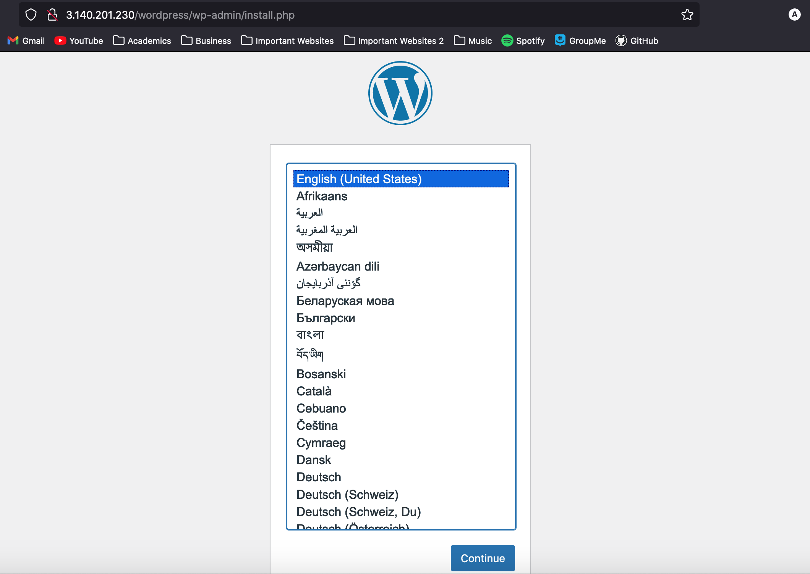

We fill out our DB credentials:

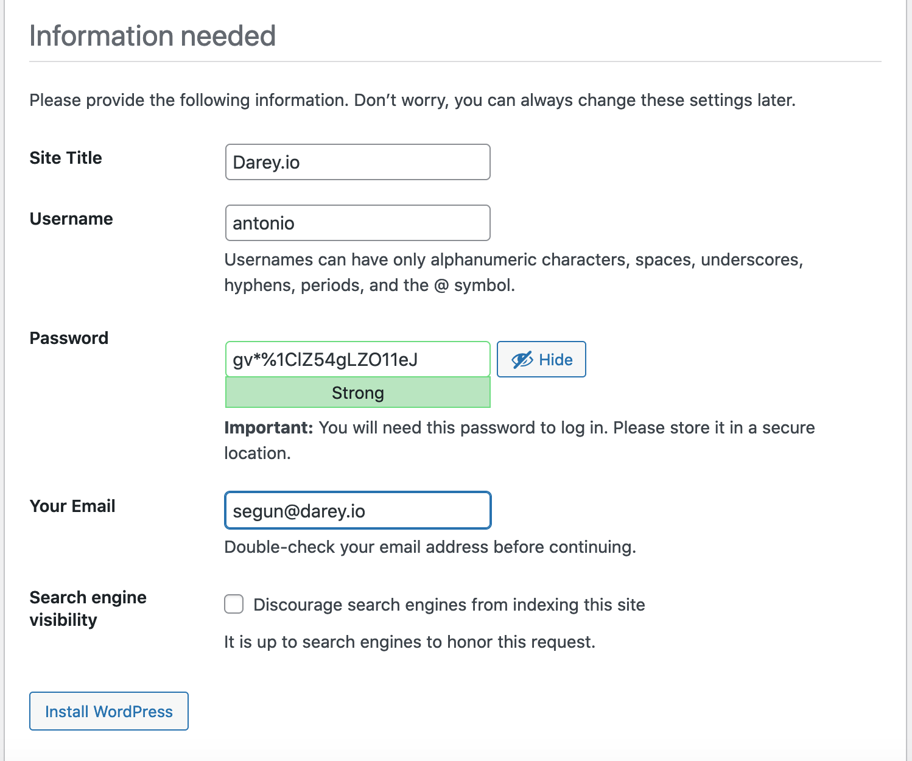

And we now log in!

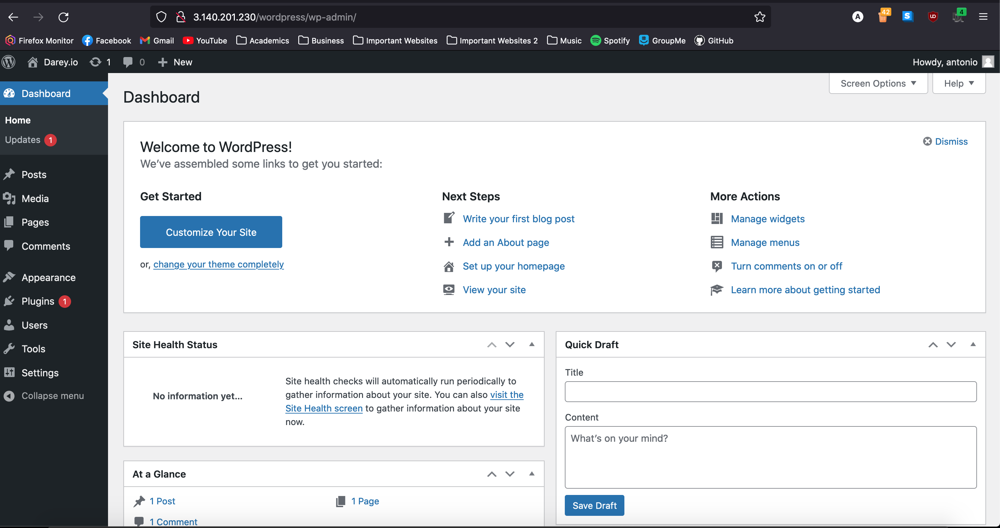

Congrats!! You have just configured a storage subsystem for web and database servers based on Red Hat Enterprise Linux (RHEL) 8 HVM, installed WordPress and connected it to a remote MySQL database server!